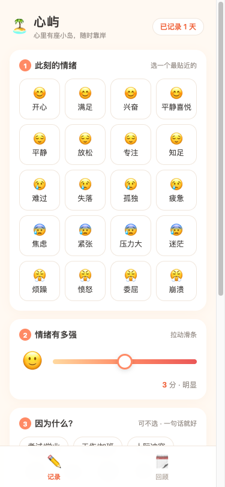

# 🏝️ 心屿 · 情绪日记与自我关怀应用

> **在线访问**：https://mood-isle.app.workbuddy.host/ （手机浏览器打开体验最佳）
>
> 心里有座小岛，情绪起伏时随时靠岸。

一个面向年轻人（18-30 岁）的低门槛情绪记录与自我关怀在线应用。无需注册、无社交压力，30 秒完成一次情绪记录，数据保存在自己的设备上。



---

## 1. 任务背景与前后相关性

### 1.1 题目来源

本项目是「网站开发」限时开发任务的作品，题目为 **《情绪日记与自我关怀应用》**：

> 年轻人面临学业、职场、社交等多重压力，情绪波动频繁，但缺乏低门槛的情绪记录与疏解工具；专业心理咨询成本高、预约难，难以日常使用。
>
> 任务要求：① 情绪记录（标签、强度评分、备注、日历/时间轴视图）；② 情绪分析（触发因素识别、可视化统计、周期性总结）；③ 自助调节（冥想、音乐、运动、呼吸练习推荐，收藏与效果反馈）；④ 用户体验（温暖友好、操作低门槛、适配移动端）。
>
> 交付要求：优先呈现清晰的产品结构与功能设计；**必须提供可在线访问的部署链接**，而非仅本地运行。

### 1.2 开发路线：先设计，后落地

本项目采取「**PRD 先行 → 雏形快速上线 → 持续迭代**」的三段式路线，各阶段成果相互衔接：

| 阶段 | 产出 | 状态 | 与本仓库的关系 |
|------|------|------|--------------|
| ① 产品设计 | 完整 PRD（九章节：用户画像、信息架构、四大功能模块详述、数据模型、技术方案、里程碑、风险应对） | ✅ 已完成 | 收录于 [`docs/PRD-心屿-情绪日记与自我关怀应用.md`](docs/PRD-心屿-情绪日记与自我关怀应用.md) |
| ② 雏形上线 | M1 核心闭环（情绪记录 + 日历/时间轴回看）+ 呼吸练习，部署至公网 | ✅ 本仓库当前版本 | `index.html` |
| ③ 持续迭代 | 情绪分析看板、方案库与效果反馈等（PRD 中的 M2/M3 阶段） | 🚧 规划中 | 在本仓库持续提交 |

**前后相关性总结**：PRD 定义了产品结构与功能边界 → 雏形实现 PRD 中的 M1 里程碑并优先满足交付硬要求（在线链接）→ 后续所有迭代以 PRD 为基准、以本仓库为代码基线。雏形阶段的视觉语言（奶油白底 + 珊瑚橙主色 + 五色情绪体系）即 PRD 第 4.4 节定义的设计规范。

### 1.3 关键设计决策：为什么是纯静态单页应用

限时任务下，本雏形刻意选择**零构建、零后端**的技术路线：

- 单文件 `index.html`（HTML + CSS + 原生 JS），无框架、无依赖、无打包步骤；
- 数据用浏览器 `localStorage` 存储——免注册即用，隐私数据不出设备，契合情绪记录类产品"安全、不评判"的气质；
- 部署为静态站点，天然获得 HTTPS 与 CDN 加速，更新成本极低（改完文件重新发布即生效）。

这一决策使"**在线链接始终可用、且始终是最新版**"成为架构保证，而非运维承诺。

---

## 2. 功能清单（当前版本 v0.1）

### 2.1 情绪记录（主干功能一）

- **五色情绪标签体系**：5 大类 × 20 个标签，颜色作为全局视觉语言——
  🟡 积极（开心/满足/兴奋/平静喜悦）· 🟢 平静（平静/放松/专注/知足）· 🔵 低落（难过/失落/孤独/疲惫）· 🟠 焦虑（焦虑/紧张/压力大/迷茫）· 🔴 激烈（烦躁/愤怒/委屈/崩溃）
- **强度滑条 1-5**：每档配表情与文字（轻微 → 爆表），降低数字抽象感；
- **触发因素**：考试/学业、工作/加班、人际冲突、感情、家庭、健康、经济、天气、睡眠、其他，可多选；
- **一句话备注**：无字数要求，想说就说；
- **今日记录列表**：实时回显当天已记录条目与"已记录 N 天"徽章。

### 2.2 情绪回看（主干功能二）

- **日历视图**：月历网格，每格底色 = 当日记录的情绪主色（多记录取强度加权主色），深浅 = 平均强度，一眼看出整月情绪地貌；点击日期展开当日详情；
- **时间轴视图**：按时间倒序的卡片流（情绪图标 + 强度 + 触发因素 + 备注 + 时间），支持删除；
- **近 7 天情绪占比条**：五色堆叠条 + 图例，快速感知近期情绪构成；
- **月份切换**：支持前后翻月回看历史。

### 2.3 自助调节（闭环补充）

- 高强度负面情绪（低落/焦虑/激烈 且强度 ≥ 4）保存后，**自动弹出"要不要舒缓一下"建议卡**，一键进入 **4-7-8 呼吸练习**（吸气 4s → 屏息 7s → 呼气 8s，共 4 轮，圆圈动画引导）；
- 记录页常驻"自由练习 1 分钟呼吸"入口。

### 2.4 用户体验与安全边界

- **移动优先**：底部 Tab 导航、≥44px 触控目标、拇指热区布局、`safe-area` 适配刘海屏；
- **免注册即用**：打开即可记录，数据存本地（`localStorage`）；
- **无社交压力**：无点赞、无排行、无公开内容，所有数据仅本人可见；
- **心理健康边界**：全站常驻全国心理援助热线 **12356**（24 小时）入口，明确"心屿不能替代专业帮助"。

---

## 3. 技术方案

| 维度 | 选型 | 说明 |
|------|------|------|
| 架构 | 纯静态单页应用（SPA） | 单文件 `index.html`，内嵌 CSS + 原生 JavaScript |
| 存储 | `localStorage` | key `xinyu_entries`，JSON 数组结构，无后端 |
| 布局 | 移动优先响应式 | 内容区 `max-width: 480px` 居中，桌面端同样可用 |
| 动画 | CSS transition + setTimeout 状态机 | 呼吸练习 4-7-8 节奏引导 |
| 部署 | WorkBuddy Sites 静态托管 | HTTPS + 反向代理域名，见第 5 节 |

**数据结构**（`xinyu_entries` 数组元素）：

```json
{
  "id": 1759000000000,
  "cat": "anx",              // 情绪大类：joy / calm / sad / anx / angry
  "tag": "压力大",            // 具体标签
  "intensity": 4,             // 强度 1-5
  "triggers": ["考试/学业"],   // 触发因素数组
  "note": "一句话备注",
  "ts": 1759000000000         // 时间戳
}
```

---

## 4. 本地运行

无需安装任何依赖，二选一：

```bash
# 方式一：直接用浏览器打开
open index.html

# 方式二：起一个本地静态服务（推荐，体验与线上一致）
python3 -m http.server 8080
# 然后访问 http://localhost:8080
```

---

## 5. 部署机制：链接不变、内容常新

**在线链接**：https://mood-isle.app.workbuddy.host/

本项目通过 WorkBuddy 内置的「发布应用」能力部署为静态站点。核心机制：

1. **本地目录即发布源**：`index.html` 所在的本地项目目录绑定一个线上应用；
2. **重新发布 = 原地更新**：对**同一目录**再次执行发布，线上内容即被覆盖为最新版，**访问链接（域名）保持不变**；
3. **他人实时可见**：由于链接不变，任何持有链接的人在打开时看到的就是最新版网站，无需任何额外操作。

因此，后续每一次代码修改的工作流是：

```
修改 index.html  →  本地验证  →  对同一目录重新发布  →  同一链接自动呈现最新版
```

---

## 6. 如何参与修改与持续提交

本仓库是后续所有迭代的**唯一代码基线**，协作流程：

1. **拉取最新代码**：`git pull origin main`，保证本地与本仓库一致；
2. **修改代码**：所有产品代码集中在 `index.html`（样式、结构、逻辑同文件内按区块注释分区）；文档在 `docs/`；
3. **本地验证**：按第 4 节本地运行，走一遍核心流程（记录 → 回顾 → 呼吸练习）；
4. **提交**：
   ```bash
   git add -A
   git commit -m "feat: 新增XX功能 / fix: 修复XX问题"
   git push origin main
   ```
5. **上线**：对本地项目目录重新执行发布（链接不变，内容更新为刚提交的版本）。

**提交信息约定**：`feat:` 新功能 · `fix:` 修复 · `style:` 样式调整 · `docs:` 文档 · `refactor:` 重构。

**迭代方向**（详见 PRD 第七、八节）：
- M2 情绪分析：情绪分布环形图、30 天趋势线、触发因素 TOP5、时段分布、周报/月报总结；
- M3 自助调节扩展：冥想/音乐/运动/书写方案库、情绪-方案推荐映射、收藏与效果反馈（练习前后强度对比）；
- M4 打磨：深色模式、数据导出、PWA 离线支持。

---

## 7. 目录结构

```
mood-isle/
├── index.html                                # 应用本体（HTML + CSS + JS 单文件）
├── README.md                                 # 本文档
└── docs/
    ├── PRD-心屿-情绪日记与自我关怀应用.md      # 完整产品需求文档（九章节）
    └── test-mobile.png                       # 移动端（375×812）渲染截图
```

---

## 8. 交叉审核测试记录

上线后已对线上站点完成 15 项真实浏览器交叉测试，全部通过：

| # | 测试项 | 结果 |
|---|--------|------|
| 1 | 线上可达性（HTTP 200） | ✅ |
| 2 | 页面结构完整渲染（20 标签 / 滑条 / 触发因素 / 热线 / 双 Tab） | ✅ |
| 3 | 情绪标签选择与高亮联动 | ✅ |
| 4 | 强度滑条 input 事件与文案联动 | ✅ |
| 5 | 触发因素多选/取消 | ✅ |
| 6 | 完整保存流程（标签+强度+触发+备注 → localStorage） | ✅ |
| 7 | 高强度负面情绪 → 呼吸建议卡自动弹出 | ✅ |
| 8 | 今日记录列表与"已记录 N 天"徽章更新 | ✅ |
| 9 | 日历视图当日色块（强度加权深浅） | ✅ |
| 10 | 日历格子点击展开当日详情 | ✅ |
| 11 | 时间轴卡片流渲染 | ✅ |
| 12 | 近 7 天情绪占比条与图例 | ✅ |
| 13 | 呼吸练习浮层与 4-7-8 节奏启动 | ✅ |
| 14 | 刷新页面后数据持久化（localStorage） | ✅ |
| 15 | 移动端 375×812 视口：Tab 固定、4 列网格、布局无错位 | ✅ |

> 备注：测试中 headless 浏览器截图的 emoji 显示为单色轮廓，为截图环境缺少彩色 emoji 字体所致；真机（iOS / Android / 桌面浏览器）均正常显示彩色 emoji。

---

## 9. 说明

- 本项目为限时开发任务的作品雏形，产品不构成心理咨询服务；如需专业帮助，请拨打全国心理援助热线 **12356**（24 小时）。
- 数据完全存储在用户本地浏览器中，清除浏览器数据即删除全部记录；产品服务端不收集任何个人信息。
