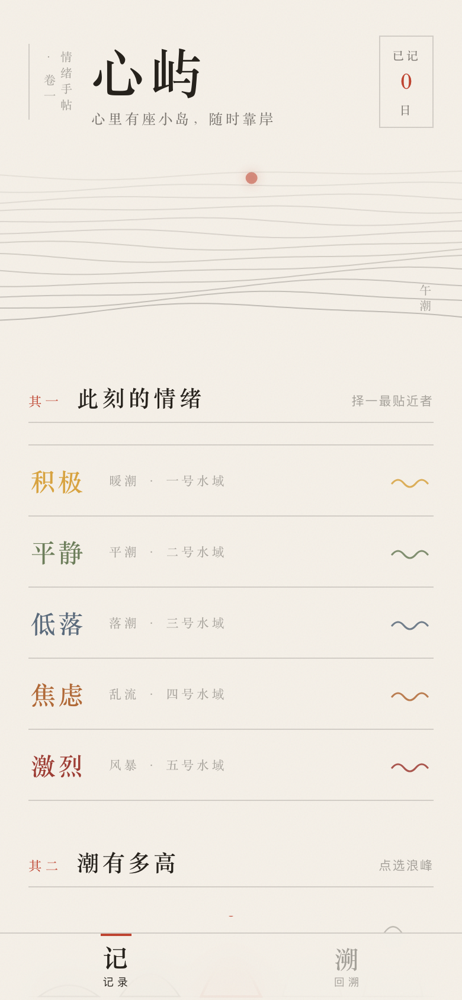
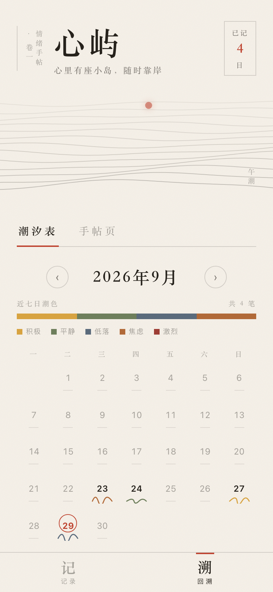
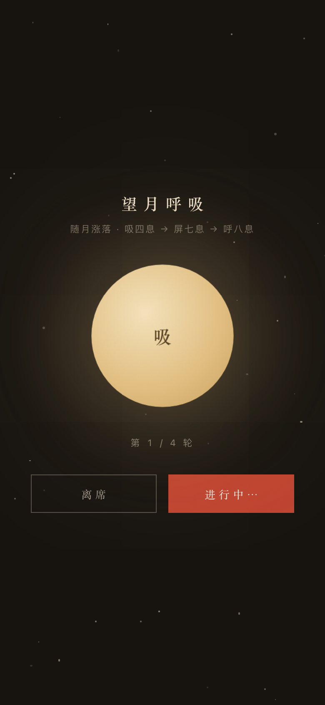

# 心屿 · 情绪手帖（纸上潮汐）

> **在线访问**：https://mood-isle.app.workbuddy.host/ （手机浏览器打开体验最佳）
>
> 心里有座小岛，随时靠岸。

一个面向年轻人（18-30 岁）的低门槛情绪记录与自我关怀在线应用。无需注册、无社交压力，30 秒完成一次情绪记录，数据保存在自己的设备上。

| 记录 · 纸上手帖 | 回顾 · 潮汐表 | 调节 · 望月呼吸 |
|---|---|---|
|  |  |  |

---

## 1. 任务背景与前后相关性

### 1.1 题目来源

本项目是「网站开发」限时开发任务的作品，题目为 **《情绪日记与自我关怀应用》**：

> 年轻人面临学业、职场、社交等多重压力，情绪波动频繁，但缺乏低门槛的情绪记录与疏解工具；专业心理咨询成本高、预约难，难以日常使用。
>
> 任务要求：① 情绪记录（标签、强度评分、备注、日历/时间轴视图）；② 情绪分析（触发因素识别、可视化统计、周期性总结）；③ 自助调节（冥想、音乐、运动、呼吸练习推荐，收藏与效果反馈）；④ 用户体验（温暖友好、操作低门槛、适配移动端）。
>
> 交付要求：优先呈现清晰的产品结构与功能设计；**必须提供可在线访问的部署链接**，而非仅本地运行。

### 1.2 开发路线

| 阶段 | 产出 | 状态 | 与本仓库的关系 |
|------|------|------|--------------|
| ① 产品设计 | 完整 PRD（九章节） | ✅ 已完成 | [`docs/PRD-心屿-情绪日记与自我关怀应用.md`](docs/PRD-心屿-情绪日记与自我关怀应用.md) |
| ② 雏形上线 | M1 核心闭环（v0.1：记录 + 回看 + 呼吸练习） | ✅ 已完成 | git 历史首个提交 |
| ③ 设计重构 | **v0.2「纸上潮汐」**：全方位视觉与交互重构 | ✅ 本仓库当前版本 | `index.html` + [`docs/设计方案-v0.2-纸上潮汐.md`](docs/设计方案-v0.2-纸上潮汐.md) |
| ④ 持续迭代 | 情绪分析看板、方案库与效果反馈（PRD M2/M3） | 🚧 规划中 | 在本仓库持续提交 |

### 1.3 关键设计决策：为什么是纯静态单页应用

限时任务下，本项目刻意选择**零构建、零后端**的技术路线：

- 单文件 `index.html`（HTML + CSS + 原生 JS + Canvas），无框架、无依赖、无打包步骤；
- 数据用浏览器 `localStorage` 存储——免注册即用，隐私数据不出设备，契合情绪记录类产品"安全、不评判"的气质；
- 部署为静态站点，天然获得 HTTPS 与 CDN 加速，更新成本极低（改完文件重新发布即生效）。

这一决策使"**在线链接始终可用、且始终是最新版**"成为架构保证，而非运维承诺。

---

## 2. v0.2 设计语言：纸上潮汐

> 完整方案见 [`docs/设计方案-v0.2-纸上潮汐.md`](docs/设计方案-v0.2-纸上潮汐.md)。此处为摘要。

v0.2 的重构目标是同时避开两类趋同：**AI 生成站点的模板感**（蓝紫渐变、玻璃拟态卡片、emoji 图标网格）与**市售情绪 App 的套路感**（马卡龙色、表情网格、打卡 streak）。参照 2025–2026 Awwwards 获奖站点的共性（编辑排版当家、单一强调色、颗粒肌理、克制的签名动效），并结合产品名自带的岛屿意象，确立了「纸上潮汐」语言：

- **纸**：暖纸底 `#F5F0E8` + 全站 SVG 颗粒噪点，印刷质感；
- **墨**：宋体衬线排版 + 发丝线分隔 + 竖排批注，东方编辑网格，去卡片化；
- **朱砂**：全站唯一强调色 `#C04531`，只用于交互态、印章、今日标记；
- **潮**：页首生成式潮汐 Canvas（随晨/昼/暮/夜变光色、响应指针扰动、保存时落涟漪），强度改称「微澜/轻浪/涌浪/大浪/怒潮」，日历是一张迷你潮汐表，呼吸练习是墨夜望月；
- **情绪五色**采用东方矿物颜料（雌黄/松绿/黛蓝/赭石/茜红），全部降饱和、零渐变。

**签名动效**（尊重 `prefers-reduced-motion`）：① 潮汐 Canvas（rAF 多层流线 + 日月运行 + 指针扰动 + 记录涟漪）；② 朱印保存（盖印动画）；③ 潮汐表波浪 staggered 描画；④ 望月呼吸（月相涨落 + 星尘）。

---

## 3. 功能清单（当前版本 v0.2）

### 3.1 情绪记录（主干功能一）

- **五色情绪标签体系**：5 大类 × 20 个标签，手风琴式选择（大类 = 汉字 + 潮名 + 波浪线，展开纯文字标签，选中墨底反白）；
- **潮汐标尺**：强度 1–5 以五座渐高浪峰呈现（支持点选/拖动），配以海的词汇（微澜 → 怒潮），替代抽象数字与滑条；
- **触发因素**：考试/学业、工作/加班、人际冲突、感情、家庭、健康、经济、天气、睡眠、其他，可多选；
- **一句话备注**：手帖横线输入，无字数压力（80 字上限）；
- **今日记录列表**与页首"已记 N 日"印章徽章。

### 3.2 情绪回看（主干功能二）

- **潮汐表（日历视图）**：月历中每个有记录的日子绘一条迷你波浪（波高 = 当日平均强度、色 = 强度加权主导情绪），今日朱砂圈标记；点击日期展开当日手帖详情；波浪依次描画入场；
- **手帖页（时间轴视图）**：按日分组的日记排版（大号衬线日期 + 周几 + 发丝线分隔），条目含情绪、浪级、触发因素、备注、时间，支持删除；
- **近七日潮色**：五色堆叠条 + 图例 + 总笔数；
- **月份切换**：前后翻月回看历史。

### 3.3 自助调节（闭环补充）

- 高强度负面情绪（低落/焦虑/激烈 且强度 ≥ 4）保存后，自动弹出「宜缓」建议卡，一键进入**望月呼吸**（4-7-8：吸 4s → 屏 7s → 呼 8s，共 4 轮，墨夜星空 + 暖月随节奏涨落）；
- 记录页常驻"对月自由呼吸一分钟"入口；
- 保存记录时，页首海面落下携带情绪色的涟漪——每条记录都真实改变这片海。

### 3.4 用户体验与安全边界

- **移动优先**：底部汉字 Tab（记/溯）、≥44px 触控目标、`safe-area` 适配刘海屏；
- **免注册即用**：打开即可记录，数据存本地（`localStorage`）；
- **无社交压力**：无点赞、无排行、无公开内容；
- **动效克制**：全站遵循 `prefers-reduced-motion`，开启后 Canvas 静态化、动画降级；
- **心理健康边界**：全站常驻全国心理援助热线 **12356**（24 小时）。

---

## 4. 技术方案

| 维度 | 选型 | 说明 |
|------|------|------|
| 架构 | 纯静态单页应用 | 单文件 `index.html`，内嵌 CSS + 原生 JavaScript |
| 存储 | `localStorage` | key `xinyu_entries`（v0.1 起未变，数据零迁移成本） |
| 图形 | Canvas 2D（潮汐）+ 内联 SVG（浪峰标尺、日历波浪） | 无第三方库 |
| 动画 | rAF 状态机 + CSS transition（cubic-bezier 编排） | 呼吸练习月相、涟漪、印章、滚动浮现 |
| 布局 | 移动优先响应式 | 内容区 `max-width: 480px`，潮汐画布全出血 |
| 部署 | WorkBuddy Sites 静态托管 | HTTPS + 反向代理域名，见第 6 节 |

**数据结构**（`xinyu_entries` 数组元素，与 v0.1 完全兼容）：

```json
{
  "id": 1759000000000,
  "cat": "anx",
  "tag": "压力大",
  "intensity": 4,
  "triggers": ["考试/学业"],
  "note": "一句话备注",
  "ts": 1759000000000
}
```

---

## 5. 本地运行

无需安装任何依赖，二选一：

```bash
# 方式一：直接用浏览器打开
open index.html

# 方式二：起一个本地静态服务（推荐，体验与线上一致）
python3 -m http.server 8080
# 然后访问 http://localhost:8080
```

---

## 6. 部署机制：链接不变、内容常新

**在线链接**：https://mood-isle.app.workbuddy.host/

本项目通过 WorkBuddy 内置的「发布应用」能力部署为静态站点。核心机制：

1. **本地目录即发布源**：项目目录绑定一个线上应用；
2. **重新发布 = 原地更新**：对**同一目录**再次执行发布，线上内容即被覆盖为最新版，**访问链接（域名）保持不变**；
3. **他人实时可见**：链接不变，任何持有链接的人打开即见最新版。

工作流：`修改 index.html → 本地验证 → 对同一目录重新发布 → 同一链接自动呈现最新版`。

---

## 7. 如何参与修改与持续提交

1. **拉取最新代码**：`git pull origin main`；
2. **修改代码**：产品代码集中在 `index.html`（按区块注释分区）；文档在 `docs/`；
3. **本地验证**：按第 5 节运行，走一遍核心流程（记录 → 回顾 → 呼吸练习）；
4. **提交**：
   ```bash
   git add -A
   git commit -m "feat: 新增XX功能 / fix: 修复XX问题"
   git push origin main
   ```
5. **上线**：对本地项目目录重新执行发布（链接不变）。

**提交信息约定**：`feat:` 新功能 · `fix:` 修复 · `style:` 样式调整 · `docs:` 文档 · `refactor:` 重构。

**迭代方向**（详见 PRD 第七、八节）：
- M2 情绪分析：情绪分布、30 天趋势线、触发因素 TOP5、周报/月报；
- M3 自助调节扩展：冥想/音乐/运动/书写方案库、收藏与效果反馈；
- M4 打磨：数据导出、PWA 离线支持。

---

## 8. 目录结构

```
mood-isle/
├── index.html                                  # 应用本体（HTML + CSS + JS 单文件）
├── README.md                                   # 本文档
└── docs/
    ├── PRD-心屿-情绪日记与自我关怀应用.md        # 完整产品需求文档（九章节）
    ├── 设计方案-v0.2-纸上潮汐.md                # v0.2 设计重构方案
    ├── v0.2-record.png                         # 记录页截图（390×844）
    ├── v0.2-calendar.png                       # 潮汐表截图
    ├── v0.2-breath.png                         # 望月呼吸截图
    └── test-mobile.png                         # 移动端渲染截图（最新版）
```

---

## 9. 测试记录

### v0.2（自动化端到端，无头浏览器 390×844 + 1280×900）

| # | 测试项 | 结果 |
|---|--------|------|
| 1 | 页面渲染：5 情绪大类 / 10 触发签 / 5 浪峰标尺 / 潮汐 Canvas 实际绘像素 | ✅ |
| 2 | 手风琴展开 → 标签选中（墨底反白） | ✅ |
| 3 | 浪峰标尺点选 → 浪名联动（怒潮·五） | ✅ |
| 4 | 触发多选 + 备注计数 | ✅ |
| 5 | 完整保存：localStorage 写入 + 高强度负向情绪弹出「宜缓」建议卡 + 印章/toast 反馈 | ✅ |
| 6 | 今日列表与"已记 N 日"徽章更新 | ✅ |
| 7 | 潮汐表：有记录日绘波浪（4 日 4 浪）、今日朱砂圈、图例与近七日占比条 | ✅ |
| 8 | 点击日期展开当日手帖详情 | ✅ |
| 9 | 时间轴按日分组渲染（4 笔 4 组） | ✅ |
| 10 | 望月呼吸：星空 42 星尘、月相 4-7-8 节奏启动、轮次推进 | ✅ |
| 11 | 删除条目（4 → 3） | ✅ |
| 12 | 桌面端 1280 视口布局无错位 | ✅ |
| 13 | 全程 console 零报错 | ✅ |

### v0.1（15 项真机交叉测试）

上线后曾对 v0.1 完成 15 项真实浏览器交叉测试（可达性、记录全流程、日历/时间轴、呼吸练习、数据持久化、移动端视口等），全部通过。详见 git 历史。

---

## 10. 说明

- 本项目为限时开发任务的作品，产品不构成心理咨询服务；如需专业帮助，请拨打全国心理援助热线 **12356**（24 小时）。
- 数据完全存储在用户本地浏览器中，清除浏览器数据即删除全部记录；产品服务端不收集任何个人信息。
