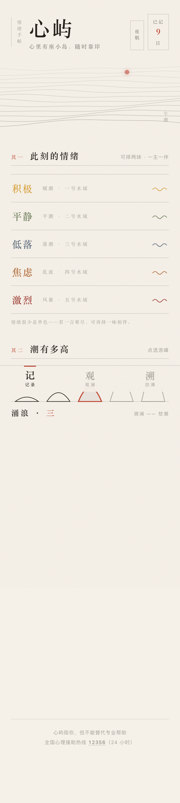
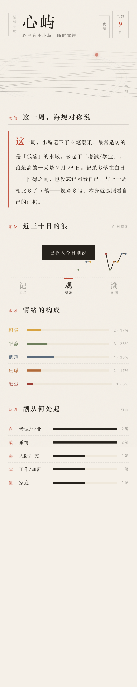
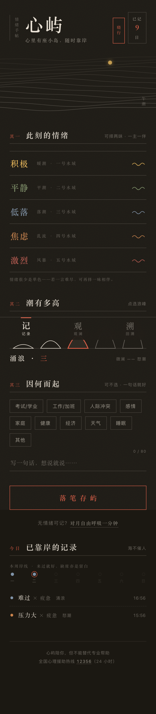

# 心屿 · 情绪手帖（纸上潮汐）

> **在线访问**：https://mood-isle.app.workbuddy.host/ （手机浏览器打开体验最佳）
>
> 心里有座小岛，随时靠岸。

一个面向年轻人（18-30 岁）的低门槛情绪记录与自我关怀在线应用。无需注册、无社交压力、无打卡焦虑，30 秒完成一次情绪记录，数据保存在自己的设备上。

| 记录 · 一主一伴 | 观澜 · 潮信与分析 | 夜航模式 |
|---|---|---|
|  |  |  |

---

## 1. 任务背景与前后相关性

### 1.1 题目来源

本项目是「网站开发」限时开发任务的作品，题目为 **《情绪日记与自我关怀应用》**：

> 年轻人面临学业、职场、社交等多重压力，情绪波动频繁，但缺乏低门槛的情绪记录与疏解工具；专业心理咨询成本高、预约难，难以日常使用。
>
> 任务要求：① 情绪记录（标签、强度评分、备注、日历/时间轴视图）；② 情绪分析（触发因素识别、可视化统计、周期性总结）；③ 自助调节（冥想、音乐、运动、呼吸练习推荐，收藏与效果反馈）；④ 用户体验（温暖友好、操作低门槛、适配移动端）。
>
> 交付要求：优先呈现清晰的产品结构与功能设计；**必须提供可在线访问的部署链接**，而非仅本地运行。

### 1.2 开发路线

| 阶段 | 产出 | 状态 | 与本仓库的关系 |
|------|------|------|--------------|
| ① 产品设计 | 完整 PRD（九章节） | ✅ 已完成 | [`docs/PRD-心屿-情绪日记与自我关怀应用.md`](docs/PRD-心屿-情绪日记与自我关怀应用.md) |
| ② 雏形上线 | M1 核心闭环（v0.1：记录 + 回看 + 呼吸练习） | ✅ 已完成 | git 历史首个提交 |
| ③ 设计重构 | v0.2「纸上潮汐」：全方位视觉与交互重构 | ✅ 已完成 | [`docs/设计方案-v0.2-纸上潮汐.md`](docs/设计方案-v0.2-纸上潮汐.md) |
| ④ 功能深化 | **v0.3「观澜」**：基于用户痛点调研的差异化功能包 | ✅ 本仓库当前版本 | `index.html` + [`docs/设计方案-v0.3-观澜.md`](docs/设计方案-v0.3-观澜.md) |

### 1.3 关键设计决策：为什么是纯静态单页应用

- 单文件 `index.html`（HTML + CSS + 原生 JS + Canvas/SVG），无框架、无依赖、无打包步骤；
- 数据用浏览器 `localStorage` 存储——免注册即用，隐私数据不出设备，契合情绪记录类产品"安全、不评判"的气质；
- 部署为静态站点，天然获得 HTTPS 与 CDN 加速；**在线链接始终可用、且始终是最新版**是架构保证，而非运维承诺。

---

## 2. 设计语言：纸上潮汐（v0.2 确立，v0.3 沿用）

> 完整方案见 [`docs/设计方案-v0.2-纸上潮汐.md`](docs/设计方案-v0.2-纸上潮汐.md)。

同时避开两类趋同：**AI 生成站点的模板感**（蓝紫渐变、玻璃拟态卡片、emoji 图标网格）与**市售情绪 App 的套路感**（马卡龙色、表情网格、打卡 streak）。纸为底（暖纸 + 颗粒）、墨为字（宋体衬线 + 发丝线 + 竖排）、朱砂为印（唯一强调色）、潮为动（生成式潮汐 Canvas、浪峰标尺、潮汐表日历、望月呼吸）。

---

## 3. v0.3「观澜」：基于用户痛点的差异化

> 完整方案见 [`docs/设计方案-v0.3-观澜.md`](docs/设计方案-v0.3-观澜.md)。此处为摘要。

v0.3 的功能选型不来自竞品功能清单，而来自对情绪类产品**真实用户抱怨**的调研（Daylio/How We Feel/Reflectly 等的长尾差评与英文社区讨论）：

| 用户痛点（证据） | v0.3 对策 |
|---|---|
| "记了五年半，得到的是漂亮的图表和零洞察" | **潮信**：自然语言叙事周结，不写判断、只讲贴近记录的事实 |
| 35% 差评提及断签挫败，62% 焦虑用户因 streak 更焦虑 | **反打卡**：本周岸线只呈现不惩罚，缺席是留白，全站无 streak |
| "情绪不是单色的"（混合情绪是高频诉求） | **相伴情绪**：一主一伴两味情绪，1 : 0.5 加权贯穿全局 |
| 换机丢记录是长期差评点 | **导出手帖 .md + 备份 .json**，数据主权在用户 |
| 练了呼吸不知道有没有用 | **调匀档案**：练前练后浪级对比闭环 |
| 想找某个诱因的所有记录找不到 | **手帖页全文搜索** |

三条产品理念：**海不催人 · 数据是回声不是报表 · 情绪不是单色**。

---

## 4. 功能清单（当前版本 v0.3）

### 4.1 情绪记录
- 五色情绪体系（5 大类 × 20 标签），手风琴选择；**相伴情绪**：可择第二味（主朱砂实点、伴朱砂空心点）；
- 潮汐标尺：浪峰选强度（微澜 → 怒潮），支持点选/拖动；
- 触发因素多选 + 手帖横线备注（80 字）；
- **本周岸线**：一至日七点位呈现本周记录（当日主导情绪色），无计数、无连续天数——反打卡设计；
- 今日记录列表 + 页首"已记 N 日"印章。

### 4.2 观澜（情绪分析，新第三 Tab）
- **潮信**：叙事化周结（笔数、主导水域、第一诱因、浪最高的一天、时辰倾向、环比上周），稀疏数据降级为勉励文案；
- **30 日潮位曲线**：Catmull-Rom 平滑 SVG 曲线 + 主导情绪色点，入场描画动画；
- **水域构成**：五色横条占比（相伴按 0.5 计）；
- **诱因榜 TOP5**、**时辰分布**（晨/昼/暮/夜）；
- **调匀档案**：呼吸次数 + 练前练后平均潮退级数。

### 4.3 回溯
- 潮汐表日历（波高 = 强度、色 = 加权主导情绪；翻月滑动动画）；
- 手帖页时间轴（按日分组）+ **全文搜索**（备注/情绪/诱因）；
- 近七日潮色占比条。

### 4.4 自助调节
- 高强度负向情绪（含相伴）保存后弹出「宜缓」建议卡；
- 望月呼吸 4-7-8（墨夜星空 + 月相涨落）；
- **练后反馈**：练习完成问"此刻的浪？"，从建议卡进入自动对比练前浪级（"怒潮 → 轻浪，潮退三级"），写入调匀档案。

### 4.5 夜航模式
完整暗色设计令牌（非反色）：墨纸、暖墨字、颜料色提亮保对比、潮汐 Canvas 双色版，0.6s 全站过渡，`localStorage` 持久化。

### 4.6 数据主权与安全边界
- **导出手帖 .md**（按日分组的排版文本）+ **备份 .json**（含呼吸日志），本地下载无服务器；
- 免注册、无社交、无通知、无 streak；全站常驻心理援助热线 **12356**；
- 全站遵循 `prefers-reduced-motion`。

---

## 5. 技术方案

| 维度 | 选型 | 说明 |
|------|------|------|
| 架构 | 纯静态单页应用 | 单文件 `index.html`，零依赖零构建 |
| 存储 | `localStorage` | `xinyu_entries`（v0.1 起兼容，`cat2/tag2` 为增量可选字段）、`xinyu_breath_log`、`xinyu_night`（均为 additive key） |
| 图形 | Canvas 2D（潮汐）+ 手卷 SVG（浪峰标尺、日历波浪、潮位曲线、构成条） | 无第三方库 |
| 动画 | rAF 状态机 + CSS transition/keyframes | 描画、滑动、月相、印章，尊重 reduced-motion |
| 主题 | CSS 变量设计令牌（昼/夜双套） | `body.night` 整体切换 |
| 部署 | WorkBuddy Sites 静态托管 | 见第 7 节 |

**数据结构**（`xinyu_entries` 元素；`cat2/tag2` 为 v0.3 增量可选）：

```json
{
  "id": 1759000000000,
  "cat": "anx",
  "tag": "压力大",
  "cat2": "sad",
  "tag2": "疲惫",
  "intensity": 4,
  "triggers": ["考试/学业"],
  "note": "一句话备注",
  "ts": 1759000000000
}
```

---

## 6. 本地运行

```bash
open index.html
# 或
python3 -m http.server 8080   # http://localhost:8080
```

---

## 7. 部署机制：链接不变、内容常新

**在线链接**：https://mood-isle.app.workbuddy.host/

本地目录绑定线上应用；对同一目录重新发布 = 原地覆盖更新，**访问链接永远不变**。工作流：`修改 index.html → 本地验证 → 重新发布 → 同一链接呈现最新版`。

---

## 8. 如何参与修改与持续提交

1. `git pull origin main`；
2. 产品代码集中在 `index.html`（按区块注释分区）；文档在 `docs/`；
3. 本地验证核心流程（记录 → 观澜 → 回溯 → 呼吸）；
4. 提交：`git add -A && git commit -m "feat: ..." && git push origin main`；
5. 对本地项目目录重新执行发布（链接不变）。

**提交信息约定**：`feat:` 新功能 · `fix:` 修复 · `style:` 样式 · `docs:` 文档 · `refactor:` 重构 · `chore:` 杂项。

**后续迭代方向**：M3 方案库扩展（冥想/音乐/书写）、PWA 离线支持、导入恢复（备份回灌）。

---

## 9. 目录结构

```
mood-isle/
├── index.html                                  # 应用本体（HTML + CSS + JS 单文件）
├── README.md                                   # 本文档
└── docs/
    ├── PRD-心屿-情绪日记与自我关怀应用.md        # 完整产品需求文档
    ├── 设计方案-v0.2-纸上潮汐.md                # v0.2 视觉重构方案
    ├── 设计方案-v0.3-观澜.md                    # v0.3 功能深化方案（痛点调研依据）
    ├── v0.2-*.png / v0.3-*.png                 # 各版本截图
    └── test-mobile.png                         # 移动端渲染截图（最新版）
```

---

## 10. 测试记录

### v0.3（自动化端到端，无头浏览器 390×844）

| # | 测试项 | 结果 |
|---|--------|------|
| 1 | 三 Tab 结构 / 本周岸线 7 点位（有记录日填色） | ✅ |
| 2 | 相伴情绪：两味可选（主实点/伴空心点），第三味被拦截并提示 | ✅ |
| 3 | 相伴情绪随保存写入 `cat2/tag2`，今日列表显示"难过 × 疲惫" | ✅ |
| 4 | 潮信：8 笔数据生成完整叙事（主导水域/诱因/峰值日/时辰/环比） | ✅ |
| 5 | 潮位曲线：连续段平滑曲线 + 9 个情绪色点 | ✅ |
| 6 | 水域构成 5 行 / 诱因榜 TOP5 / 时辰四柱 / 调匀统计（平均潮退 1.5 级） | ✅ |
| 7 | 导出 .md 与 .json 双文件下载成功 | ✅ |
| 8 | 时间轴搜索"催婚"精确命中 1 条 | ✅ |
| 9 | 夜航：令牌切换、Canvas 换色、localStorage 持久化、按钮文案联动 | ✅ |
| 10 | 呼吸反馈：高强度保存 → 建议卡 → 练习 → "怒潮 → 轻浪 · 潮退三级"写入日志 | ✅ |
| 11 | 全程 console 零报错 | ✅ |

### v0.2（13 项）/ v0.1（15 项）

分别覆盖视觉重构与雏形全功能，全部通过，详见 git 历史与对应设计文档。

---

## 11. 说明

- 本项目为限时开发任务的作品，产品不构成心理咨询服务；如需专业帮助，请拨打全国心理援助热线 **12356**（24 小时）。
- 数据完全存储在用户本地浏览器中，清除浏览器数据即删除全部记录；产品服务端不收集任何个人信息。
